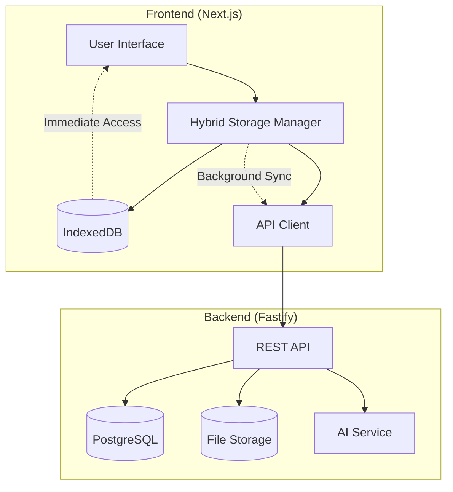

# Architecture Update: Hybrid Storage System

## 🔄 **Problem Solved**

The original frontend and backend plans had conflicting storage architectures:

- **Frontend**: Offline-first with IndexedDB
- **Backend**: Cloud-first with PostgreSQL

This created integration issues and duplicate functionality.

## 🎯 **New Unified Approach: Hybrid Storage**

### Core Principles

1. **Local-First**: All data immediately stored in IndexedDB for instant access
2. **Cloud Sync**: Background synchronization with backend when online
3. **Progressive Enhancement**: Works offline, enhanced when online
4. **Guest Mode**: Full functionality without account creation

### Data Flow Architecture



### Storage Strategy

| Operation  | Local (IndexedDB) | Cloud (API)        | Behavior              |
| ---------- | ----------------- | ------------------ | --------------------- |
| **Create** | ✅ Immediate      | 🔄 Background sync | Instant UI update     |
| **Read**   | ✅ Primary source | 📥 Sync on startup | Offline-capable       |
| **Update** | ✅ Immediate      | 🔄 Background sync | Optimistic updates    |
| **Delete** | ✅ Immediate      | 🔄 Background sync | Soft delete with sync |

## 🔧 **Implementation Changes**

### Frontend Updates

#### New Components Added:

- **HybridStorageManager**: Manages local + cloud storage
- **API Client**: Handles backend communication with offline queue
- **Sync Service**: Background synchronization with conflict resolution

#### Modified Tasks:

- **Task 10**: API client integration (was direct OpenAI)
- **Task 11**: Hybrid storage implementation
- **Task 12**: Backend AI integration (was client-side AI)
- **Task 13**: Cloud-synced notes system
- **Task 14**: Multi-device reading positions

### Backend Updates

#### Enhanced Features:

- **Guest User Support**: APIs work without authentication
- **Incremental Sync**: Delta updates for efficiency
- **Conflict Resolution**: Timestamp-based conflict handling
- **Migration APIs**: Guest-to-user account transitions

#### Modified Tasks:

- **Task 16**: Hybrid storage support (was simple API client)

### Shared Infrastructure

#### New Files Created:

- `shared/types/api.ts`: Unified TypeScript interfaces
- `shared/config/api.ts`: API configuration and constants

## 📊 **User Experience Improvements**

### Before (Conflicted Architecture)

```
❌ Offline: Limited functionality
❌ Online: Duplicate processing (client + server AI)
❌ Sync: No multi-device support
❌ Auth: Required for basic features
```

### After (Hybrid Architecture)

```
✅ Offline: Full functionality with IndexedDB
✅ Online: Enhanced with cloud sync + server AI
✅ Sync: Seamless multi-device synchronization
✅ Auth: Optional - guest mode supported
```

## 🔄 **Migration Path**

### Phase 1: Current State → Hybrid

1. Keep existing IndexedDB implementation
2. Add API client layer
3. Implement background sync
4. Add optional authentication

### Phase 2: Enhanced Features

1. Multi-device conflict resolution
2. Server-side AI integration
3. Advanced sync strategies
4. Performance optimizations

## 🧪 **Testing Strategy Updates**

### New Test Scenarios:

- **Offline/Online Transitions**: Data consistency during network changes
- **Multi-Device Sync**: Same user on multiple devices
- **Conflict Resolution**: Simultaneous edits on different devices
- **Guest Migration**: Converting guest data to authenticated account
- **Performance**: Sync efficiency with large datasets

### Updated Test Requirements:

- All existing accessibility tests remain
- Added sync-specific test scenarios
- Performance testing for hybrid operations
- Multi-device integration testing

## 🚀 **Benefits Achieved**

1. **No Breaking Changes**: Existing offline functionality preserved
2. **Progressive Enhancement**: Users get benefits gradually
3. **Flexible Authentication**: Works with or without accounts
4. **Better Performance**: Local-first with cloud enhancement
5. **Unified Codebase**: Shared types prevent API mismatches
6. **Scalable Architecture**: Supports future multi-platform expansion

## 📋 **Next Steps**

1. **Frontend**: Implement Tasks 10-12 (API client, hybrid storage, backend AI)
2. **Backend**: Complete Tasks 2-9 (infrastructure, auth, AI service)
3. **Integration**: Test hybrid storage with real backend
4. **Optimization**: Performance tuning for sync operations

This hybrid approach resolves all architectural conflicts while maintaining the app's core offline-first philosophy and accessibility focus.
