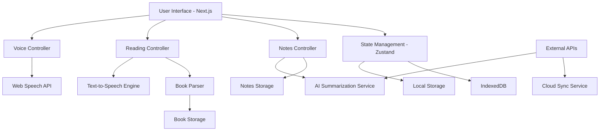

# Design Document

## Overview

The Voice-Interactive Reading App is a Next.js-based web application that provides a hands-free reading experience through voice commands and text-to-speech functionality. The system integrates modern web APIs for speech recognition and synthesis, AI services for content summarization, and a robust data management layer for books, notes, and user preferences.

## Architecture

### High-Level Architecture



### Technology Stack

- **Frontend Framework**: Next.js 14 with App Router
- **UI Components**: Tailwind CSS + Headless UI
- **State Management**: Zustand for global state
- **Speech Recognition**: Web Speech API (SpeechRecognition) with Vietnamese language support
- **Text-to-Speech**: Web Speech API (SpeechSynthesis) with Vietnamese voices
- **Natural Language Processing**: OpenAI API or local NLP models for Vietnamese intent recognition
- **AI Summarization**: OpenAI API or similar service with Vietnamese language support
- **Local Storage**: IndexedDB for books and notes
- **File Processing**: PDF.js for PDF parsing, epub.js for EPUB files
- **Audio Processing**: Web Audio API for enhanced voice processing
- **Language Processing**: Vietnamese tokenization and keyword extraction libraries

## Components and Interfaces

### Core Components

#### 1. VoiceController

```typescript
interface VoiceController {
  startListening(): void;
  stopListening(): void;
  processCommand(command: string): Promise<void>;
  parseNaturalLanguage(text: string): Promise<CommandIntent>;
  isListening: boolean;
  confidence: number;
  language: string;
}

interface CommandIntent {
  action: string;
  parameters: Record<string, any>;
  confidence: number;
  originalText: string;
}
```

**Responsibilities:**

- Manage speech recognition lifecycle with Vietnamese language support
- Parse natural language commands using NLP processing
- Extract intent and parameters from free-form Vietnamese speech
- Support flexible command variations and synonyms
- Provide visual feedback for listening state
- Handle recognition errors and retries

#### 2. ReadingEngine

```typescript
interface ReadingEngine {
  loadBook(bookId: string): Promise<Book>;
  navigateToPage(pageNumber: number): void;
  navigateToChapter(chapterName: string): void;
  getCurrentPosition(): ReadingPosition;
  startReading(): void;
  pauseReading(): void;
  adjustSpeed(speed: number): void;
}
```

**Responsibilities:**

- Book loading and parsing
- Navigation within books
- Text-to-speech management
- Reading position tracking

#### 3. NotesManager

```typescript
interface NotesManager {
  createNote(content: string, position: ReadingPosition): Promise<Note>;
  getNotes(bookId: string): Promise<Note[]>;
  searchNotes(query: string): Promise<Note[]>;
  deleteNote(noteId: string): Promise<void>;
  syncNotes(): Promise<void>;
}
```

**Responsibilities:**

- Note creation and management
- Search functionality
- Position-based note linking
- Cloud synchronization

#### 4. SummarizationService

```typescript
interface SummarizationService {
  summarizeText(
    text: string,
    type: "page" | "chapter" | "book",
    language?: "vi" | "en"
  ): Promise<string>;
  generateKeyPoints(text: string): Promise<string[]>;
  isAvailable(): boolean;
}
```

**Responsibilities:**

- AI-powered content summarization in Vietnamese and English
- Key point extraction
- Service availability checking

#### 5. NaturalLanguageProcessor

```typescript
interface NaturalLanguageProcessor {
  parseVietnameseCommand(text: string): Promise<CommandIntent>;
  extractBookTitle(text: string): string | null;
  extractPageNumber(text: string): number | null;
  extractChapterReference(text: string): string | null;
  identifyAction(text: string): string;
  getConfidenceScore(text: string, intent: CommandIntent): number;
}
```

**Responsibilities:**

- Process free-form Vietnamese voice commands
- Extract entities (book titles, page numbers, chapters) from natural speech
- Map Vietnamese phrases to system actions
- Handle command variations and synonyms
- Provide confidence scoring for intent recognition

### UI Components

#### 1. VoiceIndicator

- Visual feedback for listening state
- Confidence level display
- Command recognition status

#### 2. ReadingView

- Book content display
- Reading progress indicator
- Navigation controls
- Voice command overlay

#### 3. NotesPanel

- Notes list and search
- Note creation interface
- Position-based note display

#### 4. LibraryView

- Book grid/list display
- Upload interface
- Search and filtering

## Data Models

### Book Model

```typescript
interface Book {
  id: string;
  title: string;
  author: string;
  content: BookContent;
  metadata: BookMetadata;
  lastReadPosition: ReadingPosition;
  createdAt: Date;
  updatedAt: Date;
}

interface BookContent {
  chapters: Chapter[];
  totalPages: number;
  format: "pdf" | "epub" | "txt";
}

interface Chapter {
  id: string;
  title: string;
  content: string;
  startPage: number;
  endPage: number;
}
```

### Note Model

```typescript
interface Note {
  id: string;
  bookId: string;
  content: string;
  position: ReadingPosition;
  timestamp: Date;
  tags: string[];
}

interface ReadingPosition {
  page: number;
  chapter: string;
  characterOffset: number;
  percentage: number;
}
```

### User Preferences

```typescript
interface UserPreferences {
  voiceSettings: {
    recognitionLanguage: string; // Default: 'vi-VN' for Vietnamese
    speechRate: number;
    speechVoice: string;
    volume: number;
    nlpSensitivity: number; // Confidence threshold for natural language processing
  };
  readingSettings: {
    fontSize: number;
    theme: "light" | "dark";
    autoBookmark: boolean;
  };
  aiSettings: {
    summaryLength: "short" | "medium" | "long";
    summaryStyle: "bullet" | "paragraph";
    summaryLanguage: "vi" | "en"; // Vietnamese or English summaries
  };
}
```

## Error Handling

### Voice Recognition Errors

- **No microphone access**: Fallback to keyboard input with clear instructions
- **Recognition failure**: Retry mechanism with user feedback in Vietnamese
- **Ambient noise**: Noise filtering and confidence threshold adjustment
- **Unsupported browser**: Graceful degradation with alternative input methods
- **Vietnamese language recognition**: Fallback to English recognition if Vietnamese fails
- **Natural language parsing errors**: Provide suggested command formats when intent is unclear

### Natural Language Processing

**Vietnamese Command Examples:**

- "Mở sách [tên sách]" → Open book [book title]
- "Đọc to cho tôi nghe" → Read aloud to me
- "Tóm tắt chương này" → Summarize this chapter
- "Ghi chú: [nội dung]" → Take note: [content]
- "Chuyển sang trang tiếp theo" → Go to next page
- "Tìm trong ghi chú về [từ khóa]" → Search in notes for [keyword]

**Flexible Command Handling:**

- Support multiple ways to express the same intent
- Handle incomplete commands with clarification requests
- Process commands with filler words and natural speech patterns
- Recognize Vietnamese numbers and ordinals
- Handle mixed Vietnamese-English commands

### Text-to-Speech Errors

- **Voice unavailable**: Fallback to default system voice
- **Synthesis failure**: Error notification with manual reading option
- **Rate limiting**: Queue management and user notification

### AI Service Errors

- **API unavailable**: Cached summaries and offline mode
- **Rate limiting**: Request queuing and user notification
- **Invalid content**: Content preprocessing and error handling

### Storage Errors

- **Quota exceeded**: Storage cleanup and user notification
- **Sync failures**: Offline mode with retry mechanism
- **Corrupted data**: Data validation and recovery procedures

## Testing Strategy

### Unit Testing

- **Voice command parsing**: Test Vietnamese command recognition accuracy with various phrasings
- **Natural language processing**: Test intent extraction from free-form Vietnamese speech
- **Book navigation**: Verify page/chapter navigation logic with Vietnamese commands
- **Note management**: Test CRUD operations and search functionality with Vietnamese content
- **Summarization**: Mock AI service responses and test integration with Vietnamese text

### Integration Testing

- **Speech API integration**: Test browser compatibility and error handling
- **File processing**: Test various book formats and edge cases
- **Storage operations**: Test IndexedDB operations and data persistence
- **Cross-component communication**: Test state management and event flow

### End-to-End Testing

- **Voice workflow**: Complete user journey from voice command to action
- **Reading session**: Full reading experience with TTS and navigation
- **Note-taking flow**: Voice note creation and retrieval
- **Multi-device sync**: Test data synchronization across devices

### Accessibility Testing

- **Screen reader compatibility**: Ensure proper ARIA labels and semantic HTML
- **Keyboard navigation**: Test all functionality without mouse/voice
- **Voice command alternatives**: Provide manual alternatives for all voice features
- **Visual indicators**: Clear feedback for all system states

### Performance Testing

- **Large book handling**: Test with books of various sizes
- **Voice processing latency**: Measure response times for commands
- **Memory usage**: Monitor memory consumption during long reading sessions
- **Network optimization**: Test offline capabilities and sync performance

## Security Considerations

### Data Privacy

- **Local storage**: Encrypt sensitive user data in IndexedDB
- **Voice data**: Ensure no voice recordings are stored permanently
- **AI service integration**: Minimize data sent to external services
- **User consent**: Clear permissions for microphone and data usage

### Content Security

- **File upload validation**: Sanitize and validate uploaded book files
- **XSS prevention**: Proper content sanitization for user-generated notes
- **API security**: Secure communication with external AI services
- **Rate limiting**: Prevent abuse of AI summarization services
